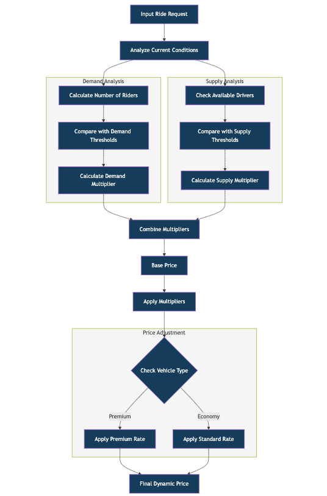

# Dynamic Pricing Strategy &nbsp;

Dynamic pricing is a sophisticated pricing strategy where businesses adjust prices in real-time based on market conditions and demand patterns. It is employed by businesses to optimize their revenue and profitability by setting flexible prices that respond to market demand, customer behaviour, and competitor pricing. &nbsp;

The aim is to maximize revenue and profitability by pricing items at the right level that balances supply and demand dynamics. It allows businesses to adjust prices dynamically based on factors like time of day, day of the week, customer segments, inventory levels, seasonal fluctuations, competitor pricing, and market conditions.
To implement a data-driven dynamic pricing strategy, businesses typically require data that can provide insights into customer behaviour, market trends, and other influencing factors.

For Example: Companies like Uber, airlines, and hotels commonly use this approach to maximize revenue by charging higher prices during peak demand and lower prices during quiet periods. This strategy helps balance supply and demand while optimizing profits, though it requires robust data analysis systems and clear communication with customers about price changes.

# Dynamic FareML
### Overview
This project explores the implementation of a dynamic pricing strategy using data science techniques. The goal is to analyze various factors influencing ride pricing, such as historical data, demand-supply metrics, and ride durations, to predict and optimize prices dynamically.

### Features
(i) Data Analysis: Insights into historical ride costs, ride durations, and vehicle type trends.

(ii) Profitability Metrics: Calculation of profit percentage for rides and categorization into profitable and loss-making rides.

(iii) Predictive Modeling: Machine learning models for predicting ride costs based on multiple features.

(iv) Visualization: Interactive charts and graphs, including:
- Correlation heatmaps
- Scatter plots for actual vs predicted values
- Profitability distribution via donut charts

(v) Optimization: Recommendations for price adjustments to maximize profits.

### Workflow

### Results
- Achieved high prediction accuracy for ride costs.
- Identified key factors influencing pricing.
- Delivered actionable insights for dynamic pricing strategies.
